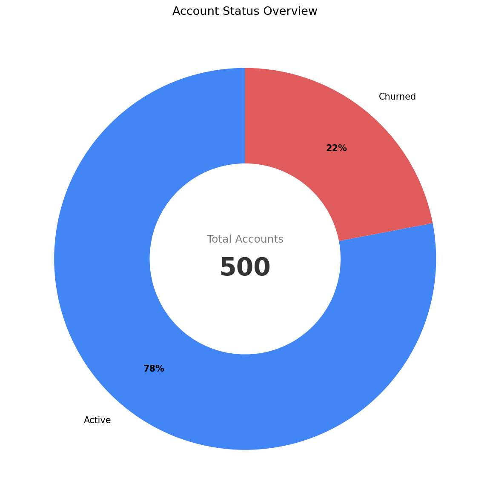

Note: the datasets used within this project are synthetic, generated specifically for SaaS analytics practices.

## Business Problem

RavenStack is a SaaS startup delivering AI-driven team tools. The product was piloted with coding bootcamp graduates. The leadership team is observing a high permanent churn rate and is concerned regarding the issues before the upcoming public launch. This analysis aims to:

- Find how many users churned and the revenue impact
- Identify the primary reasons behind churn and whether it is growing
- Provide recommendations to improve user retention before the public launch

## Tools & Methods

- SQL (BigQuery) for churned accounts identification and breakdowns for (1) lost MRR by churn reason code and (2) churned accounts by month
- Python (pandas & matplotlib) for creating visualizations for lost MRR by churn reason code and churned accounts by month

## Findings
- Out of 500 users who signed up, 110 (22%) churned and never came back

  

**Important Note:** 35 users are marked as churned, but don't have a churn_event record, ***they were excluded from the remainder of the analysis***
- The 75 accounts with complete churn records represent $183,460 in lost MRR.
  - Budget is the leading churn driver — 17 accounts, but they were among the highest-paying, accounting for $75,820 in lost MRR with an average of $4,460 per account

  

- From the timeline perspective, churn started growing fast since 2024-08

  

## Recommendations

- Introduce a subscription pause option or clearly outline available downgrade possibilities for users to reduce budget-driven churn
- Prioritize product stability, 20% of churn is caused by feature issues which indicates that the product might not be ready for public adoption
- Delay the public launch or test a soft launch until the reasons for churn growth since August, 2024 are clarified

## Next Steps

- Analyze feature usage data to identify which specific features correlate with churn
- Collaborate with the cancellation flow PM to fix gaps in the process (32% of churned accounts have no churn records)
- Investigate what caused the churn growth since August, 2024
